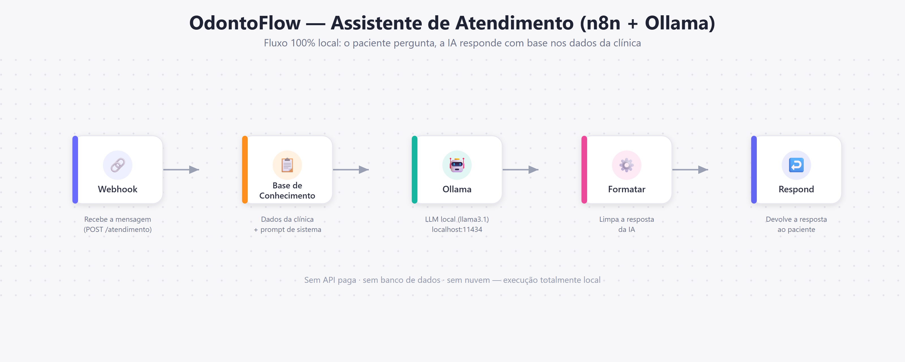

# 🦷 OdontoFlow — Assistente Inteligente de Atendimento para Clínicas

> Agente de IA **100% local e gratuito** que responde automaticamente às dúvidas mais comuns dos pacientes de uma clínica odontológica, usando **n8n** para orquestração e **Ollama** para inteligência artificial.


---

## 📌 Sobre o projeto

Clínicas odontológicas recebem, todos os dias, as **mesmas perguntas**: horário, tratamentos, valores, convênios, endereço e como agendar. Responder tudo manualmente consome tempo da recepção e atrasa o atendimento.

Este projeto resolve isso com uma **recepcionista virtual inteligente**: o paciente envia uma mensagem, um modelo de linguagem (LLM) rodando **localmente** interpreta a pergunta e gera uma resposta educada, profissional e baseada nas informações reais da clínica — **sem custo de API, sem serviços externos e sem banco de dados**.

### Problema resolvido

- ⏱️ **Tempo perdido** da recepção respondendo perguntas repetitivas.
- 💸 **Custo** com plataformas de chatbot e APIs pagas.
- 🔒 **Privacidade** dos dados dos pacientes: nada sai da máquina — tudo roda offline.
- 📉 **Perda de pacientes** por demora na resposta e no agendamento.

---

## 🧠 Como funciona

```
        Paciente
          │  (envia uma mensagem)
          ▼
   ┌─────────────┐
   │  Webhook    │   n8n recebe a mensagem via HTTP POST
   └─────────────┘
          │
          ▼
   ┌─────────────┐
   │     Set     │   Injeta a base de conhecimento da clínica
   │  (Base de   │   + o prompt de sistema
   │Conhecimento)│
   └─────────────┘
          │
          ▼
   ┌─────────────┐
   │ HTTP Request│   Envia pergunta + contexto ao Ollama
   │  (Ollama)   │   → http://localhost:11434/api/generate
   └─────────────┘
          │
          ▼
   ┌─────────────┐
   │    Code     │   Limpa e formata a resposta da IA
   │ (Formatar)  │
   └─────────────┘
          │
          ▼
   ┌─────────────┐
   │  Respond    │   Devolve { "resposta": "..." } ao paciente
   │ to Webhook  │
   └─────────────┘
          │
          ▼
        Paciente  (recebe a resposta gerada pela IA)
```

---

## 🛠️ Tecnologias utilizadas

| Ferramenta | Função |
|------------|--------|
| **[n8n](https://n8n.io)** | Orquestração do fluxo (webhook, lógica e resposta) |
| **[Ollama](https://ollama.com)** | Execução local do modelo de IA (LLM) |
| **llama3.1:8b** (ou `mistral:7b`) | Modelo de linguagem que interpreta e responde |

Sem OpenAI. Sem API paga. Sem Docker obrigatório. Sem banco de dados. **Tudo local.**

---

## 🚀 Instalação

### 1. Instalar o Ollama

O Ollama é a ferramenta que roda o modelo de IA na sua máquina.

1. Baixe em: **https://ollama.com/download** (Windows, macOS e Linux).
2. Instale e abra o aplicativo (ele roda em segundo plano, na porta `11434`).
3. Baixe o modelo pelo terminal:

```bash
ollama pull llama3.1:8b
```

> 💡 Máquina mais modesta? Use um modelo mais leve:
> ```bash
> ollama pull mistral:7b
> ```
> Depois é só trocar o valor do campo `model` no workflow.

4. Teste se está funcionando:

```bash
ollama run llama3.1:8b "Diga apenas: OK"
```

Se responder, o Ollama está pronto. ✅

### 2. Instalar o n8n

Escolha **uma** das opções:

**Opção A — via npm (recomendada, sem Docker):**
```bash
npm install -g n8n
n8n start
```

**Opção B — executar sem instalar:**
```bash
npx n8n
```

Acesse o editor em: **http://localhost:5678**

### 3. Importar o workflow

1. Abra o n8n em `http://localhost:5678`.
2. Menu (canto superior direito) → **Import from File**.
3. Selecione o arquivo [`workflows/assistente-atendimento.json`](workflows/assistente-atendimento.json).
4. Clique em **Save** e depois em **Active** (ou use "Execute workflow" para testar em modo de teste).

---

## ▶️ Como executar e testar

Com o Ollama e o n8n rodando, o webhook fica disponível em:

```
POST http://localhost:5678/webhook/atendimento
```

> Durante os testes (botão *Execute workflow*), a URL é `.../webhook-test/atendimento`.

### Teste via cURL

```bash
curl -X POST http://localhost:5678/webhook/atendimento \
  -H "Content-Type: application/json" \
  -d "{ \"mensagem\": \"Qual o horário de funcionamento?\" }"
```

### Teste via PowerShell

```powershell
Invoke-RestMethod -Uri "http://localhost:5678/webhook/atendimento" `
  -Method Post -ContentType "application/json" `
  -Body '{ "mensagem": "Vocês fazem entrega?" }'
```

O script pronto está em [`scripts/testar.sh`](scripts/testar.sh) e [`scripts/testar.ps1`](scripts/testar.ps1).

---

## 💬 Exemplos de uso

**Entrada:**
```json
{ "mensagem": "Vocês fazem clareamento? Quanto custa?" }
```
**Saída:**
```json
{ "resposta": "Sim, realizamos clareamento dental, a partir de R$ 600. O valor final é confirmado após a avaliação com o dentista, que é gratuita." }
```

---

**Entrada:**
```json
{ "mensagem": "Qual o horário de atendimento?" }
```
**Saída:**
```json
{ "resposta": "Atendemos de segunda a sexta, das 08:00 às 19:00, e aos sábados das 08:00 às 13:00. Domingos e feriados ficamos fechados." }
```

---

**Entrada:**
```json
{ "mensagem": "Quero marcar uma consulta." }
```
**Saída:**
```json
{ "resposta": "Claro! Vou encaminhar sua solicitação de agendamento para nossa recepção pelo WhatsApp (21) 99999-9999." }
```

Mais exemplos em [`exemplos/testes.md`](exemplos/testes.md).

---

## 🗂️ Estrutura do projeto

```
assistente-atendimento-n8n-ollama/
├── README.md                          → Documentação principal
├── workflows/
│   └── assistente-atendimento.json    → Workflow do n8n (importável)
├── docs/
│   ├── configuracao-ollama.md         → Detalhes do modelo e do prompt
│   └── linkedin-e-curriculo.md        → Textos para LinkedIn e currículo
├── exemplos/
│   └── testes.md                      → Casos de teste de entrada/saída
└── scripts/
    ├── testar.sh                      → Teste rápido (cURL / bash)
    └── testar.ps1                     → Teste rápido (PowerShell)
```

---

## 🎯 O que este projeto demonstra

- ✅ **Automação de processos** de atendimento com n8n
- ✅ **Construção de agentes de IA** end-to-end
- ✅ **Uso de LLMs locais** (Ollama) sem dependência de nuvem
- ✅ **Engenharia de prompt** (system prompt + base de conhecimento controlada)
- ✅ **Integração entre ferramentas** via API REST
- ✅ **Solução real** de baixo custo para pequenas empresas

---

## 🔧 Personalização

Para adaptar a outra empresa, edite o nó **Base de Conhecimento** no n8n e altere o campo `baseConhecimento` com os dados do novo negócio. Nenhuma outra alteração é necessária.

---

## 📸 Fluxo do projeto



> 💡 Você também pode substituir esta imagem por um print do canvas real do n8n após importar o workflow.

---

## 📄 Licença

Projeto livre para fins de estudo e portfólio.
